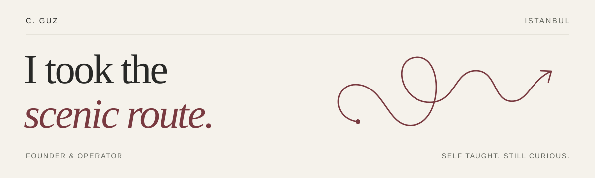

 

### Hi, I'm C. 👋

I'm a self taught founder and operator who thrives in complexity. I studied psychology, built an HRTech company, and learned product, GTM and business operations by doing the work.

I tend to follow a problem past the point where it fits neatly into a job title. That usually means piecing together scattered context, asking a lot of questions, and building something useful with the people closest to the work.

These days, I'm a **precision headhunter at H//DTC**, working with founders on mission critical roles. I also build the tools I wish I had while doing the job.

### A few things I've put into the world

**[H//DTC](https://hiredtctalent.org/?utm_source=github&utm_medium=profile)** 
My headhunting business, and the platform I built to run it. Role briefs, candidate evidence, conversations and decisions, with live searches running through it.

**Octopus** 
The HRTech company I founded. Took the product from an idea through customer discovery, a six month beta and early revenue, with a team across five time zones. A fairly thorough education in everything I hadn't studied.

**A hiring function that could run without me** 
At n8n, worked with the Product Design Lead to make hiring standards explicit. Five design hires in four months after six months without one, then a full handover so the next person could keep going.

### On my desk

Codex · v0 ♥ · Notion · a question that was supposed to be a quick one

I like people who care about what they're building, share what they know, and can change their minds. I try to be one of them.

---

[More about me](https://v0-c-me.vercel.app/?utm_source=github&utm_medium=profile) &nbsp; / &nbsp; [LinkedIn](https://www.linkedin.com/in/cgenesis/) &nbsp; / &nbsp; [say hello 👋](mailto:adyecae@gmail.com?subject=I%20brought%20the%20complexity&body=Hi%20C.%2C%0D%0A%0D%0AYou%20said%20you%20thrive%20in%20complexity.%20An%20unusually%20brave%20thing%20to%20put%20on%20the%20internet.%0D%0A%0D%0AI%20have%20something%20you%20might%20enjoy%3A%0D%0A%0D%0A%5BWhat%20we%27re%20building%2C%20what%20needs%20solving%2C%20and%20why%20I%20thought%20of%20you.%5D%0D%0A%0D%0AWorth%20a%20conversation%3F%0D%0A%0D%0A%5BYour%20name%5D%0D%0A%0D%0AP.S.%20I%20clicked%20the%20waving%20hand.%20Consider%20this%20a%20wave%20back.%20%F0%9F%91%8B)

The hello link comes with an opening line. I've done the awkward bit for you.
